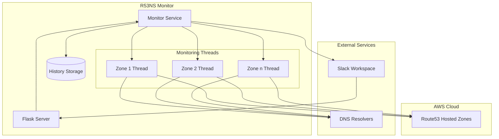
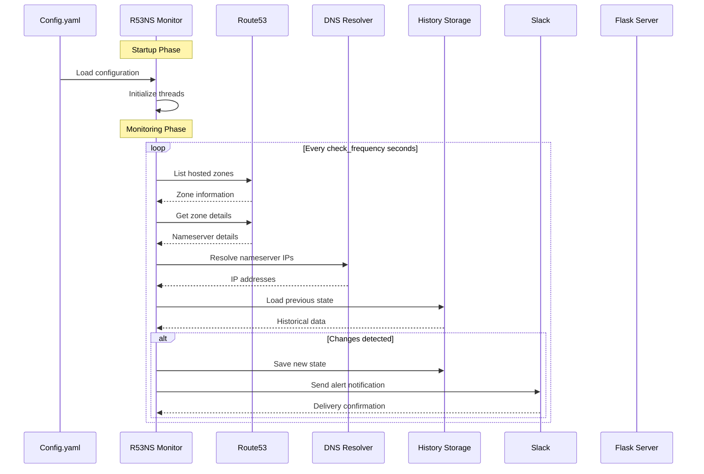

# Route53 Nameserver Monitor


A robust monitoring solution that tracks AWS Route53 nameserver changes and provides real-time Slack notifications for DNS infrastructure monitoring.


## Overview

Route53 Nameserver Monitor is a Python-based tool that continuously monitors AWS Route53 hosted zones for nameserver IP changes. It provides immediate notifications through Slack when changes are detected, helping teams maintain DNS infrastructure reliability.

## Features

- 🔍 Real-time monitoring of Route53 nameserver configurations
- 🌐 Support for both IPv4 and IPv6 address monitoring
- ⏰ Configurable monitoring frequencies per zone
- 📱 Slack integration with interactive notifications
- 🔄 Resolution workflow with acknowledgment buttons
- 📊 Historical change tracking with configurable retention
- 🏷️ Environment-based zone grouping (prod, staging, etc.)
- ⚡ Multi-threaded monitoring for efficient resource usage

## Architecture

### System Overview


### Detailed Flow


## Prerequisites

- Python 3.8+
- AWS credentials with Route53 read access
- Slack workspace with webhook configuration
- Docker (optional, for containerized deployment)

## Installation

1. Clone the repository:
```bash
git clone https://github.com/venomseven/r53ns-monitor.git
cd r53ns-monitor
```

2. Install dependencies:
```bash
pip install -r requirements.txt
```

3. Configure your environment:
```bash
cp config.yaml.example config.yaml
# Edit config.yaml with your settings
```

## Configuration

Create a `config.yaml` file with the following structure:

```yaml
monitoring:
  frequencies:
    prod: 300    # 5 minutes
    staging: 600 # 10 minutes
  retention_days: 30
  retention_entries: 1000

hosted_zones:
  prod:
    - name: "example.com"
      description: "Main production website"
      alert_channel: "#dns-alerts"
      priority: "high"
      check_frequency: 300
  staging:
    - name: "staging.example.com"
      description: "Staging environment"
      priority: "medium"
      check_frequency: 600

slack:
  webhooks:
    prod: "https://hooks.slack.com/services/YOUR/WEBHOOK/URL"
  default_channel: "#dns-monitoring"
```

## Usage

### Standard Mode
```bash
python src/r53ns-monitor.py
```

### Local Testing Mode
```bash
python src/r53ns-monitor.py --test
```

## API Endpoints

### Slack Interactions
- **POST** `/slack/interactions`
  - Handles Slack button interactions for alert resolution
  - Accepts form-encoded payloads from Slack
  - Returns resolution confirmation

## Monitoring Details

The monitor performs the following checks:
1. Queries Route53 for hosted zone configurations
2. Resolves nameserver IP addresses (IPv4 and IPv6)
3. Compares current state with historical data
4. Triggers alerts on detected changes
5. Maintains a local history of changes

## Alert Format

Slack alerts include:
- Zone identification
- Nameserver details
- Previous and new IP configurations
- Timestamp of detection
- Interactive resolution button

## Development

### Running Tests
```bash
python -m pytest tests/
```

### Local Development
```bash
# Start with debug logging
DEBUG=1 python src/r53ns-monitor.py
```

## Docker Support

Build and run with Docker:
```bash
docker build -t r53ns-monitor .
docker run -v $(pwd)/config.yaml:/app/config.yaml r53ns-monitor
```

## Contributing

1. Fork the repository
2. Create a feature branch
3. Commit your changes
4. Push to the branch
5. Create a Pull Request

## License

This project is licensed under the MIT License - see the [LICENSE](LICENSE) file for details.

## Acknowledgments

- AWS Route53 Team for their DNS service
- Slack for their interactive messaging platform
- Contributors and maintainers

## Support

For support, please:
1. Check existing issues
2. Create a new issue with detailed information

## Roadmap

- [ ] Multi-region support
- [ ] Enhanced metrics and reporting
- [ ] Additional notification channels
- [ ] Web dashboard
- [ ] API authentication
